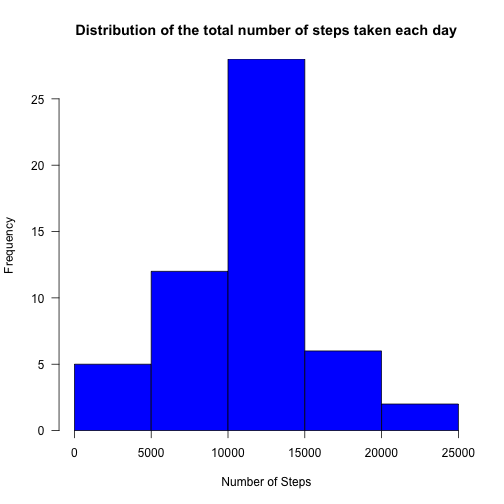
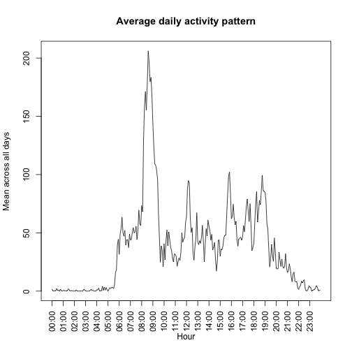
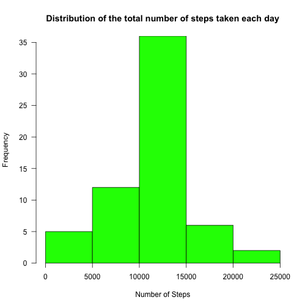
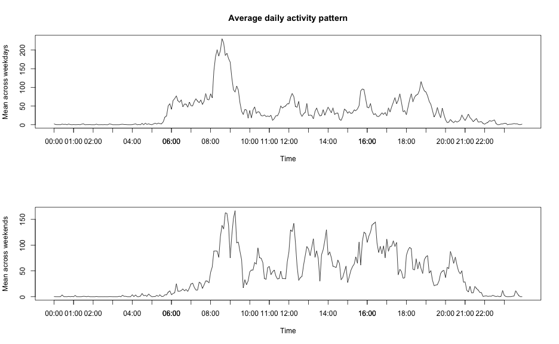

The following questions are being addressed:

1. What is mean total number of steps taken per day?
2. What is the average daily activity pattern?
3. Imputing missing values
4. Are there differences in activity patterns between weekdays and weekends?

First step is the data loading and filter out the NA step values based rows:

```r
  data = read.csv('activity.csv')
  # filter out the NA step value rows
  data = na.omit(data)
```

## What is mean total number of steps taken per day?

The distribution of the total number of steps taken each day frequencies is the following:


```r
  #create date categorie and drop the empty values ones
  ds = split(data$steps, data$date, drop=TRUE)
  #apply the sum on the date categories
  ds_sum = sapply(ds, sum, na.rm=TRUE)
  #draw the histogram
  par(yaxs='i', las=1)
  hist(ds_sum, xlab='Number of Steps', main = 'Distribution of the total number of steps taken each day', col='blue')
```

 

The mean and median of the total number of steps taken per day are computed using the following code:


```r
  tsd_mean = mean(ds_sum, na.rm=TRUE)
  tsd_median = median(ds_sum, na.rm=TRUE)
```

Their values are aproximately equal proving that the  data set are not too spread out:

Mean = **10766.19** steps

Median = **10765** steps

## What is the average daily activity pattern?


```r
  ds = split(data$steps, data$interval, drop=TRUE)
  ds_mean = sapply(ds, mean, na.rm=TRUE)
  # create a seq for time serie 24 hours as 5 min serie
  ts5m = seq(strptime('00:00','%H:%M'), strptime('23:55','%H:%M'), '5 min')
  # plot mean time serie
  plot(ds_mean ~ ts5m, type='l', main='Average daily activity pattern', xlab='Hour', ylab='Mean across all days', xaxt = "n")
  # x axis - hourly
  ts1h=seq(strptime('00:00','%H:%M'), strptime('23:59','%H:%M'), 'hour')
  axis.POSIXct(1, at = ts1h, format = "%H:%M", las=2)
```

 

```r
  # find the index of the maximum value
  idx_max = which.max(ds_mean)
```
The maximum value is **206.1698113** steps at **835** interval.

## Imputing missing values

```r
  #load the data set
  data = read.csv('activity.csv')
  #count NA-s
  dNA = sum(is.na(data$steps))
```
There are **2304** 'NA' step values.

The NA step values are replaced with the mean for that 5-minute interval:

```r
  #filter out the NA step value rows
  dataClean = na.omit(data)
  #get NAs
  dataNA = data[is.na(data$steps),]
  #compute media for 5min intervals
  dsClean = split(dataClean$steps, dataClean$interval, drop=TRUE)
  dsCleanMean = sapply(dsClean, mean, na.rm=TRUE)
  #replace all NAs with 5min interval mean
  dataNA[,'steps'] = apply(dataNA,1, function(x, m) m[[as.character(as.numeric(x[3]))]], m = dsCleanMean)
```

The column 'steps' numeric values *dsClean* are merged with the former NA values *dataNA* into a new dataframe that is equal to the original dataset but with the missing data filled in:

```r
  fillData = rbind(dataClean, dataNA)
```

The distribution of the total number of steps taken each day frequencies of this updated dataset is the following:
 
The new values for mean and median are the following:

Mean = **10766.19** steps

Median = **10766.19** steps

The frequency value for *10000-15000 steps* bin increased above **35** in comparison with **25** when NA based observations were deleted.

The impact of updating the NA observations with the mean for that 5-minute interval is that the median and the mean of the total number of steps taken each day have the same value. Another efect is that the dominant number of steps per day, between 10000-15000, increased. 

## Are there differences in activity patterns between weekdays and weekends?

Create a new factor variable **isWeekend** in the dataset with two levels *weekday* and *weekend* indicating whether a given date is a weekday or weekend day:

```r
  #create a list with a boolean variable having TRUE in case the processed day is Sat or Sun
  isWeekendl = apply(fillData, 1, function(x) grepl('Sat|Sun', weekdays(as.Date(x[2]))))
  #create a factor variable with two levels: weekday and weekend
  isWeekend = factor(isWeekendl, labels=c('weekday','weekend'))
  #merge the weekend column to the dataframe
  wkData = cbind(fillData, isWeekend)
  str(wkData)
```

```
## 'data.frame':	17568 obs. of  4 variables:
##  $ steps    : num  0 0 0 0 0 0 0 0 0 0 ...
##  $ date     : Factor w/ 61 levels "2012-10-01","2012-10-02",..: 2 2 2 2 2 2 2 2 2 2 ...
##  $ interval : int  0 5 10 15 20 25 30 35 40 45 ...
##  $ isWeekend: Factor w/ 2 levels "weekday","weekend": 1 1 1 1 1 1 1 1 1 1 ...
```

Here is a comparison between average daily activity in weekdays vs. weekends:

 

In the weekends the number of steps is increased proving that people's physical activity is better that during the weekdays.
